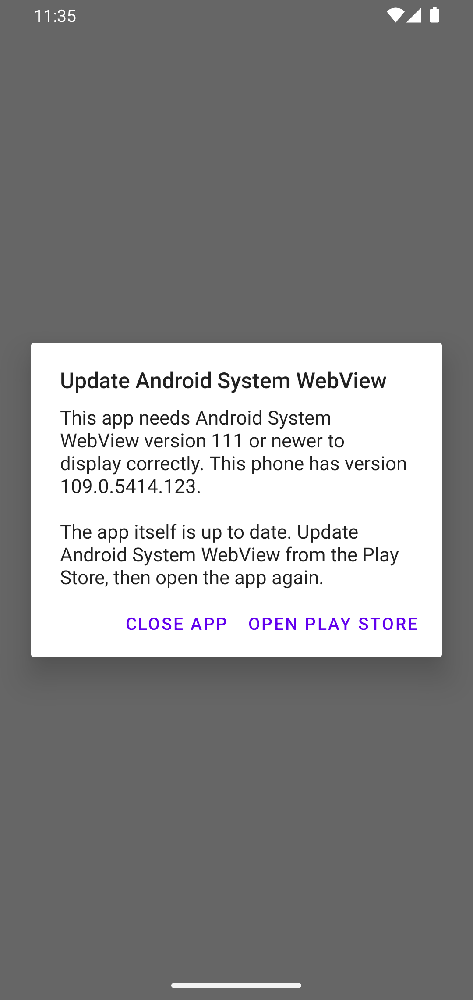
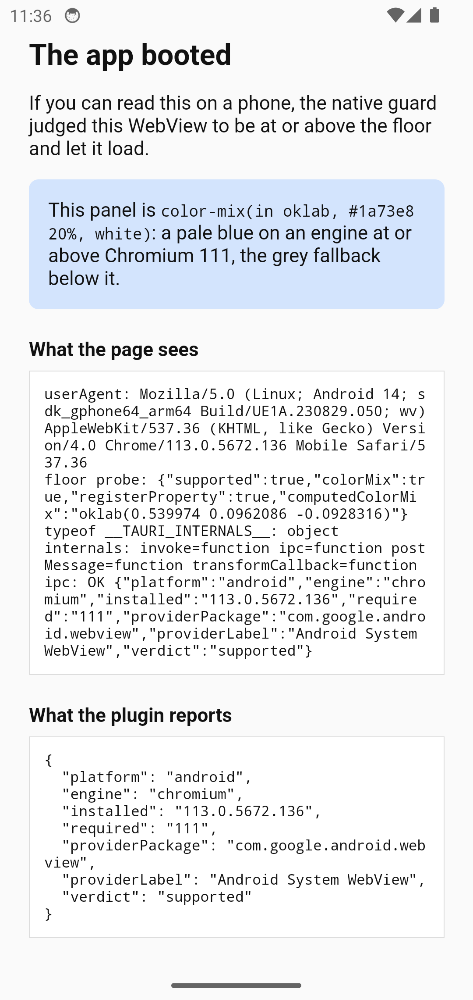

# tauri-plugin-webview-guard

Refuses to boot a Tauri v2 app into a WebView engine below its CSS floor, and
tells the user — in a **native** dialog — how to fix it.

| | |
|---|---|
| Android, Chromium 109 | Android, Chromium 113 |
|  |  |

Both screenshots are the same APK, two Chromium majors either side of the
floor. [`docs/verification/`](docs/verification/README.md) has all four
emulator arms, the iOS simulator, and what each run did and did not prove.

---

## Why this exists

Tailwind v4's browser floor is **Chromium 111 / Safari 16.4 / Firefox 128** —
the union of `color-mix()` (Chromium 111, Safari 16.2) and `@property`
(Chromium 85, Safari 16.4). Below it an app does not crash. It does something
worse:

- **Chromium 99–110** lays out perfectly and gets every derived colour wrong.
  Each `color-mix(in oklab, var(--x) 30%, transparent)` is invalid, so the token
  falls back to full strength: a 30 %-opacity skeleton becomes a near-white
  blob, a subtle border becomes a hard line. The app looks *subtly wrong*, and
  the report reads as a bug, not as an old engine.
- **Below Chromium 99** there are no cascade layers, and Tailwind v4 emits its
  entire stylesheet inside `@layer`. A parser that does not know the at-rule
  discards the whole block: a white screen.

The owner of the apps this was built for has ruled the floor final — no
normalizer, no polyfill, no transpilation. So the job is not to make an old
engine work; it is to **refuse to boot into one and say how to fix it**,
instead of showing a screen the user will read as "this app is broken".

On Android the fix is usually two taps: the WebView is a Play-updatable
component, independent of the OS. On iOS WKWebView ships with the OS, so the
real defence is the App Store refusing to install at all (see
[iOS: the deployment target is the real defence](#ios-the-deployment-target-is-the-real-defence));
the in-app check is the second line.

### Why the dialog is native, never HTML

On Chromium 53, Tauri's own injected IPC script does not parse (object spread,
Chromium 60), so `window.__TAURI_INTERNALS__.postMessage` is never defined and
**every `invoke()` rejects** — measured, see
[the verification note](docs/verification/README.md#does-tauris-ipc-work-on-chromium-53-no).
An HTML fallback page whose "Update" button calls a Tauri command is dead on
exactly the devices it exists for. An `AlertDialog` / `UIAlertController` has
no dependency on the engine it is judging.

### Why the check is native, never a JS probe in the bundle

A bundle that cannot parse cannot run the check that explains why it cannot
parse. The guard reads the engine version natively, during plugin setup —
which Tauri runs **before it creates the first WebView** — and refuses the
WebView's first navigation. [`docs/lifecycle.md`](docs/lifecycle.md) has the
sequence, with the Tauri and wry source lines behind each step.

---

## Platform support

| Platform | What it checks | Below the floor | `status()` | `openUpdate()` |
|---|---|---|---|---|
| **Android** | The WebView provider's `versionName` via `WebViewCompat.getCurrentWebViewPackage` — whichever package actually provides it, never assumed | Refuses the app's navigation, turns JS off, hides the WebView, shows an `AlertDialog` naming the provider, with **Open Play Store** and **Close app** | ✅ | ✅ `market://details?id=<provider>`, falling back to `https://play.google.com/store/apps/details?id=<provider>` |
| **iOS** | `ProcessInfo.operatingSystemVersion` (WKWebView is the OS's) | Refuses the navigation, hides the WebView, shows a `UIAlertController` saying **update iOS** — no buttons | ✅ | ❌ `Unsupported` — WKWebView has no store listing |
| **macOS / Windows / Linux** | Nothing | Nothing — logs a warning at setup | ❌ `Unsupported` | ❌ `Unsupported` |
| **Browser** (no Tauri) | The ES5 [floor probe](#the-browser-build-the-floor-probe), if you inline it | Replaces `<body>` with your template | — | — |

Desktop is compiled so `tauri dev` runs, and refuses every call with a typed
error rather than returning a verdict nobody computed. The desktop engines
(WebView2, WKWebView on macOS, WebKitGTK) are not probed.

**Android 7.x (API 24/25) does not reach the guard on stock Tauri.** Tauri
2.11.6 crashes in `TauriActivity.onCreate` on API 24/25 — jackson-databind
2.15.3's static initialiser needs `java.lang.BootstrapMethodError` (API 26) —
before any plugin is constructed. Measured on the API 24 emulator;
[tauri-apps/tauri#8788](https://github.com/tauri-apps/tauri/issues/8788), open.
Either raise `minSdk` to 26, or force an older Jackson in your generated Gradle
project as [`examples/tauri-app/android-7-jackson-workaround.zsh`](examples/tauri-app/android-7-jackson-workaround.zsh)
does (reported working in that issue, and how the Chromium 53 arm here was
verified). The plugin does not do this to your app: overriding a Tauri
dependency is your call.

---

## Installing

Pin the tag. Like its sibling
[`tauri-sign-keypair`](https://github.com/vaam-apps/tauri-sign-keypair), this
plugin is consumed by git ref, not from crates.io or npm: Rust, Kotlin, Swift
and TypeScript ship from one tag, and publishing only two of them would let
the others drift.

```bash
cargo add tauri-plugin-webview-guard --git https://github.com/vaam-apps/tauri-webview-guard --tag vX.Y.Z
npm install github:vaam-apps/tauri-webview-guard#vX.Y.Z   # only for the typed bindings or the probe
```

Register it in `src-tauri/src/lib.rs`, **first**, so its setup runs before any
plugin that might create a window:

```rust
tauri::Builder::default()
    .plugin(
        tauri_plugin_webview_guard::Builder::new()
            .min_chromium(111)
            .min_ios("16.4")
            .build(),
    )
    // ...
```

That is the whole integration. The guard is live the moment it is registered —
there is no switch to turn it on; to guard nothing, do not register it.

The frontend needs a permission only to call `status()` / `openUpdate()`:

```json
{ "permissions": ["webview-guard:default"] }
```

The guard itself needs none — it acts before any page exists, and a capability
that denies both commands leaves it fully in force.

---

## Builder options

| Option | Default | Meaning |
|---|---|---|
| `.min_chromium(u32)` | `111` | Minimum Chromium **major**, Android. Inclusive: `111` lets 111 through and blocks 110. Compared against the major of the provider's `versionName`. |
| `.min_ios(impl Into<String>)` | `"16.4"` | Minimum iOS version, `major.minor` or `major.minor.patch`. Inclusive. Parsed strictly when `.build()` runs — `"16.4-beta"` is refused. |
| `.android_copy(AndroidCopy)` | English, below | The Android dialog's title, message and two button labels. |
| `.ios_copy(IosCopy)` | English, below | The iOS alert's title and message. |
| `.build()` | — | The plugin. **Panics** if `min_ios` does not parse — a constant in your source, wrong on every launch, so it fails the first `tauri dev`. `Builder::floor()` validates without building. |

`tauri_plugin_webview_guard::init()` is `Builder::new().build()`.

### The dialog copy

The one rule every string follows: **name the component that is out of date,
and never tell the user to update the app.** The app is current; "update this
app" sends them to a listing with nothing to install.

Three placeholders are substituted in Rust, once, before the text reaches the
native side:

| Placeholder | Android | iOS |
|---|---|---|
| `{component}` | The provider's own label, as `PackageManager` reports it — "Android System WebView", "Chrome", an OEM name | `iOS` |
| `{installed}` | The provider's `versionName`, e.g. `109.0.5414.123` | e.g. `16.3.1` |
| `{required}` | The configured Chromium major, e.g. `111` | e.g. `16.4` |

Defaults:

```text
Android  title    Update {component}
         message  This app needs {component} version {required} or newer to display
                  correctly. This phone has version {installed}.

                  The app itself is up to date. Update {component} from the Play Store,
                  then open the app again.
         buttons  Open Play Store · Close app

iOS      title    Update iOS to continue
         message  This app needs iOS {required} or later. This iPhone runs iOS {installed}.

                  The app itself is up to date. Update iOS in Settings › General ›
                  Software Update, then open the app again.
```

The Android title and two buttons are deliberately unlike Android 14's own
"This app was built for an older version of Android" warning, which uses the
app name as title and a single **OK**.

The iOS alert has **no buttons**: iOS has no public URL that opens Software
Update (`openSettingsURLString` opens this app's own settings page — a dead end
dressed as a way forward), and apps are not meant to quit themselves.

A French app, for example:

```rust
use tauri_plugin_webview_guard::{AndroidCopy, Builder};

Builder::new().android_copy(AndroidCopy {
    title: "Mettez à jour {component}".into(),
    message: "Cette application a besoin de {component} {required} ou plus récent. \
              Ce téléphone a la version {installed}.\n\n\
              L'application elle-même est à jour : mettez à jour {component} \
              depuis le Play Store, puis rouvrez-la."
        .into(),
    update_button: "Ouvrir le Play Store".into(),
    close_button: "Fermer".into(),
})
```

### Android: behaviour in detail

- The provider is `WebViewCompat.getCurrentWebViewPackage(context)` from
  `androidx.webkit` — the public WebView API on 26+, reflection into
  `WebViewFactory` below. The same call returned the provider on API 24, 33,
  34 and 36.
- **Open Play Store** fires `market://details?id=<provider>`; if nothing
  handles it, `https://play.google.com/store/apps/details?id=<provider>`.
  Fired and caught, not resolved in advance, so no `<queries>` entry is needed.
  The dialog stays up — a user who comes back without updating finds the same
  dialog, not a blank app.
- **Close app** calls `finishAndRemoveTask()`.
- The dialog is not cancellable by Back or by tapping outside.
- An unreadable version (no provider, an OEM `versionName` that does not start
  with a Chromium major) is `Verdict::Unknown`: **the app boots**, with a
  warning in the log. An unreadable version is not evidence of an old engine,
  and an "update your WebView" dialog in front of a current device is the same
  dead end as the white screen.
- The plugin's classes are kept by `proguard-rules.pro` (Tauri reaches them by
  reflection; a stripped plugin would mean the guard silently never runs).

### iOS: the deployment target is the real defence

In-app, the guard can only explain. The fix for iOS is not to install at all
on a version that cannot render the app — which the App Store does for you
if the deployment target says so. **Tauri 2.11.6's default is `14.0`**
(`tauri-utils`'s `ios_minimum_system_version` at tag `tauri-v2.11.6`; the
`dev` branch already says `15.0`, so anything documented from `dev` will not
match what you ship). Either way it is below 16.4. Set it:

```json
{ "bundle": { "iOS": { "minimumSystemVersion": "16.4" } } }
```

**The trap: that key only takes effect on the first `tauri ios init`.** The CLI
writes `gen/apple/project.yml` only if it does not already exist
(`crates/tauri-cli/src/mobile/ios/project.rs` at `tauri-v2.11.6`), and no later
`tauri ios build` touches `IPHONEOS_DEPLOYMENT_TARGET`. Change the key on an
existing project and nothing happens — silently. Reproduced on this repo's
example: init at 16.4, change to 17.0, re-init → still 16.4.

The reliable route is **`bundle.iOS.template`**, which `tauri ios init`
renders with `File::create` — every time:

```json
{
  "bundle": {
    "iOS": {
      "minimumSystemVersion": "16.4",
      "template": "src-tauri/ios-project.yml"
    }
  }
}
```

with `ios-project.yml` a copy of Tauri's own template for your Tauri version
(the example carries 2.11.6's verbatim:
[`examples/tauri-app/src-tauri/ios-project.yml`](examples/tauri-app/src-tauri/ios-project.yml)).
Then re-run `tauri ios init` after every change to the key, and check:

```bash
grep -m1 IPHONEOS_DEPLOYMENT_TARGET src-tauri/gen/apple/*.xcodeproj/project.pbxproj
```

Note the path: **the template is resolved against the directory you run the
CLI in, not `src-tauri/`**. `"template": "ios-project.yml"` fails with
"failed to read custom Xcode project template" when run as `npm run tauri`
from the frontend root. Both behaviours measured:
[`docs/verification/logs/ios-trap/`](docs/verification/logs/ios-trap/).

Devices that stop at iOS 15 (iPhone 6s/6s Plus, 7/7 Plus, SE 1st generation,
iPod touch 7th generation) can never reach 16.4; for them the deployment target
is the only honest answer, and the in-app alert is a dead end by nature.

---

## The API

### Rust

```rust
use tauri_plugin_webview_guard::{WebviewGuardExt, Verdict};

let status = app.webview_guard().status()?;          // GuardStatus
if status.verdict == Verdict::Supported { /* … */ }
app.webview_guard().open_update()?;                  // UpdateOpened, Android only
```

`GuardStatus { platform, engine, installed, required, provider_package,
provider_label, verdict }` is computed once, in setup, and never recomputed.

### TypeScript (tauri-specta)

`guest-js/bindings.ts` is **generated** from the Rust command signatures by
tauri-specta and committed, so the JS package builds without a Rust toolchain.
`tests/bindings.rs` regenerates it and fails if the committed file is stale;
`UPDATE_BINDINGS=1 cargo test --test bindings` rewrites it.

```ts
import { commands } from 'tauri-plugin-webview-guard-api'

const r = await commands.status()
if (r.status === 'ok') console.log(r.data.verdict, r.data.installed)
else if (r.error.kind === 'unsupported') { /* desktop, or openUpdate on iOS */ }
```

### The error type

`WebviewGuardError` (aliased as `tauri_plugin_webview_guard::Error`),
serialised as a tagged object so a frontend switches on `kind`:

| `kind` | When | Fields |
|---|---|---|
| `unsupported` | Every call on desktop; `openUpdate` on iOS; `openUpdate` on an Android device that reported no provider | `platform`, `capability`, `reason` |
| `no_store_handler` | Android: neither the Play Store nor any browser could open the listing | `package` |
| `native` | The native side failed in a way it did not classify | `command`, `message` |

It is named `WebviewGuardError` rather than `Error` because tauri-specta
exports a type under its Rust name, and a TypeScript type called `Error`
shadows the global `Error` — including in the generated bindings' own
`typedError`, which tests `e instanceof Error`.

### Why tauri-specta is pinned to a release candidate

`tauri-specta = "=2.0.0-rc.25"`, `specta = "=2.0.0-rc.25"`,
`specta-typescript = "=0.0.12"` (dev only). tauri-specta 2 has never had a
stable release; its own crate docs say to pin with `=` during the rc period
because the generated bindings change shape between rcs. The house plugin
standard requires end-to-end types, and the owner accepts the rc for that.
`upstream.json` records what to re-check when a stable 2.0.0 lands.

---

## The browser build: the floor probe

With no native layer there is nothing to stop the bundle loading, so the
package ships an **ES5** probe to inline in `<head>`, before every other
script: [`probe/floor-probe.js`](probe/floor-probe.js).

It tests the two features the floor is actually made of, not a version string
(`color-mix()` **and** `CSS.registerProperty` as the `@property` sentinel — a
`color-mix()`-only check would wave iOS 16.2/16.3 through), and:

- always sets `<html data-webview-floor="supported|below">` and
  `window.__WEBVIEW_GUARD_FLOOR__`;
- when supported, promotes any `<script type="text/plain" data-webview-guard-src="…">`
  to a module script — so a bundle parked that way is never handed to an engine
  that cannot parse it;
- when below, replaces `<body>` with your `<template id="webview-guard-below-floor">`,
  or a plain English message.

It must be inlined, not imported. With Vite:

```ts
import { readFileSync } from 'node:fs'
import { createRequire } from 'node:module'

const probe = readFileSync(
  createRequire(import.meta.url).resolve('tauri-plugin-webview-guard-api/probe/floor-probe.js'),
  'utf8',
)
// plugins: [{ name: 'floor-probe', transformIndexHtml: (html) =>
//   html.replace('<!-- webview-guard:floor-probe -->', () => `<script>${probe}</script>`) }]
```

A Vite module script is *not* parked by default, and runs on Chromium 61–110
anyway — park it, or have your entry return early when
`document.documentElement.dataset.webviewFloor === 'below'`.

Verified on Chromium 53, 109, 113 and 134, where its verdict agreed with the
native one on every arm; the parser test (`acorn`, `ecmaVersion: 5`) keeps it
ES5.

---

## Running the tests

```bash
cargo test                                   # floor, copy, assessment, errors, bindings drift, doctest
cargo clippy --all-targets -- -D warnings
cargo clippy --target aarch64-linux-android -- -D warnings
cargo clippy --target aarch64-apple-ios -- -D warnings   # macOS

npm install && npm run typecheck && npm test && npm run build   # probe + bindings

# Kotlin JVM tests: from the example's generated Android project — `android/`
# is a Gradle subproject with no wrapper of its own.
cd examples/tauri-app && npm install && npx tauri android init
npx tauri android build --debug --target aarch64 --apk
cd src-tauri/gen/android && ./gradlew :tauri-plugin-webview-guard:testDebugUnitTest
```

On a device, the example app is the test: see
[`examples/tauri-app/README.md`](examples/tauri-app/README.md) and
[`docs/verification/`](docs/verification/README.md).

---

## Upstream provenance

[`upstream.json`](upstream.json) lists every pin, workaround and upstream
behaviour this plugin depends on — tauri-specta's rc, the Android 7 Jackson
crash, Tauri's IPC script on old engines, wry's posted first load, Tauri's
iOS `project.yml` generation — each with its URL, its state when recorded,
what it is waiting on, and what to re-check when it moves, in a shape a
scheduled job can poll.

## Licence

MIT.
