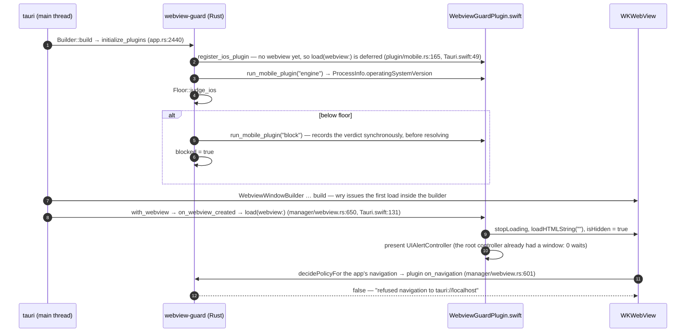

# When the guard fires, relative to first paint

The whole design rests on one question: can a Tauri v2 mobile plugin act
before the app's WebView shows — or runs — anything? The answer comes from
Tauri's own source and was then measured on devices. Every participant and
transition below cites the `file:line` that backs it, against **tauri 2.11.6**
and **wry 0.55.1**, so it can be re-checked when either moves
(`upstream.json` tracks both).

## The short answer

|             | When the native check runs                                      | When the WebView is stopped                                                                                                                                                                                                      | What the user sees before the dialog                                                                                                                                       |
| ----------- | --------------------------------------------------------------- | -------------------------------------------------------------------------------------------------------------------------------------------------------------------------------------------------------------------------------- | -------------------------------------------------------------------------------------------------------------------------------------------------------------------------- |
| **Android** | Plugin setup, inside `Builder::build`, before any window exists | In `load(webView)`, same main-thread message that created and attached the WebView, before any frame — and again after the app's posted first load, which the Rust navigation hook refuses                                       | The activity's window background (the launch theme). The WebView never paints.                                                                                             |
| **iOS**     | Plugin setup, inside `Builder::build`, before any window exists | `load(webview:)` stops and hides the view (the first load has already been _issued_ by then — `webview.url` reads `tauri://localhost`), and Tauri's navigation hook then refuses that navigation when WebKit asks for its policy | A black window (hidden WebView), then the alert. Measured 0.16 s from plugin construction to alert on the iOS 26.5 simulator, with no `page load started` for the app URL. |
| **Desktop** | Never                                                           | Never                                                                                                                                                                                                                            | Nothing is guarded; every call returns `Unsupported`.                                                                                                                      |

## Sequence (Android)

```mermaid
sequenceDiagram
    autonumber
    participant A as TauriActivity (main thread)
    participant T as tauri (Rust thread)
    participant G as webview-guard (Rust)
    participant K as WebviewGuardPlugin.kt
    participant W as RustWebView

    A->>T: onCreate → Rust.create (wry WryActivity.kt)
    T->>G: Builder::build → initialize_plugins (app.rs:2440)
    G->>K: register_android_plugin → new WebviewGuardPlugin(activity) (plugin/mobile.rs:208, :228)
    G->>K: run_mobile_plugin("engine")
    K-->>G: {package, versionName, label} via WebViewCompat.getCurrentWebViewPackage
    G->>G: Floor::judge_chromium (src/floor.rs)
    alt below floor
        G->>K: run_mobile_plugin("block", rendered copy)
        K->>A: AlertDialog.show() — no WebView exists yet
        G->>G: blocked = true (src/lib.rs, on_navigation)
    end
    T->>A: App::run → setup → WebviewWindowBuilder::from_config (app.rs:2525)
    A->>W: new RustWebView; loadUrlMainThread(url) POSTS loadUrl (main_pipe.rs:250, RustWebView.kt:40)
    A->>W: setContentView(webview) (main_pipe.rs:315)
    A->>K: onWebViewCreated → load(webView) (main_pipe.rs:320, manager/webview.rs:518, PluginManager.kt:150)
    K->>W: JS off, INVISIBLE, stopLoading, about:blank — and post the same again
    Note over A,W: the main-thread message returns — no frame was drawn with the app in it
    W->>G: posted loadUrl(app URL) → Rust.shouldOverride → plugin on_navigation (RustWebView.kt:53, manager/webview.rs:601)
    G-->>W: false — "refused navigation to http://tauri.localhost/"
    K->>W: (posted) neutralize again — belt and braces
```

The `loadUrlMainThread` step is the one that is easy to get wrong, and the first version of this
plugin did: `loadUrlMainThread` does not load, it **posts** a load, which runs
_after_ `load(webView)` returns. A guard that only blanked the WebView inside
`load` watched `about:blank` load and then the app's own
`http://tauri.localhost/` load straight after it. The fix is the Rust
`on_navigation` hook, which Tauri consults from `RustWebView.loadUrl` itself.

The plugin hook is only consulted if the WebView is already registered with
Tauri's manager when the navigation arrives (`manager/webview.rs:595-604`;
otherwise it returns `true`). That registration happens on the Rust thread
while the posted load waits on the main thread — a race Tauri does not order.
It went the guard's way on every run recorded here, and the second, posted
`neutralize` plus JavaScript-off cover the other outcome.

## Sequence (iOS)



## State: where a launch ends up

```mermaid
stateDiagram-v2
    [*] --> Setup: Builder::build
    Setup --> Probed: engine reported
    Setup --> Unknown: engine call failed
    Probed --> Supported: version ≥ floor
    Probed --> BelowFloor: version < floor
    Probed --> Unknown: version unparseable
    Supported --> AppRuns: navigation allowed
    Unknown --> AppRuns: navigation allowed (logged as a warning)
    BelowFloor --> Blocked: on_navigation refuses all but about:blank
    Blocked --> DialogShown: AlertDialog / UIAlertController
    DialogShown --> StoreOpened: Android "Open Play Store"
    StoreOpened --> DialogShown: user comes back without updating
    DialogShown --> Closed: Android "Close app" (finishAndRemoveTask)
    StoreOpened --> ProcessKilled: provider updated (not measured here)
    ProcessKilled --> [*]: next launch re-probes
    Closed --> [*]

    state "Android 7.x, stock Tauri" as Crash
    [*] --> Crash: TauriActivity.onCreate — jackson-databind 2.15.3
    Crash --> [*]: "has stopped" — the guard never runs
```

`Crash` is not a state this plugin can reach: stock Tauri 2.11.6 dies on
API 24/25 before any plugin is constructed
([tauri-apps/tauri#8788](https://github.com/tauri-apps/tauri/issues/8788),
measured in `verification/logs/cr53-stock-tauri-crash.logcat.txt`). It is drawn
here because it is what an Android 7 user actually sees unless the app raises
`minSdk` to 26 or applies the Jackson workaround; see the README.

`ProcessKilled` — Android restarting an app that holds the old WebView after a provider update — is
not something measured here: the emulators have no Play Store (`com.android.vending`
is a 1.8 stub that resolves nothing), so no update could be installed.

## What was measured, and what was not

Android: the order above is the logcat order on all four emulator arms
(`verification/logs/cr*-default.logcat.txt`); each `WebviewGuard` line carries
`SystemClock.uptimeMillis` and the thread. Below the floor there is no
`page load started` for `http://tauri.localhost/` on any arm, only for
`about:blank`.

iOS: measured only on an iOS 26.5 simulator with the floor forced to 99.0
(`verification/logs/ios26-forced99.log.txt`) — no iOS 16.3 runtime is installed
on the machine this was built on. The order is the unified-log order: WebKit
asked for the navigation policy _after_ `load(webview:)` had already hidden the
view. Whether that ordering holds on a slower device is not proven; the
navigation hook refuses the load whichever comes first, which is why both
exist. "No frame of the app was painted" is inferred from the refusal and the
absence of a `page load started` for the app URL, not from a frame capture.
